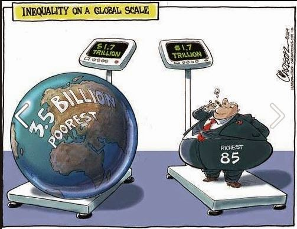

```{r setup, include=FALSE}
knitr::opts_chunk$set(echo = FALSE)

#Setting the working directories
try(setwd("/Users/emiliasicari/Desktop/Final_assignment/Final_Presentation/"))
try(setwd("/Users/rafalopezv/Dropbox/R/Final_assignment/Final_Presentation/"))
getwd()

#Sourcing external files
try(source("/Users/emiliasicari/Desktop/Final_assignment/Final_Academic_Paper/Preliminary_analyses.R"))
try(source("/Users/rafalopezv/Dropbox/R/Final_assignment/Final_Academic_Paper/Preliminary_analyses.R"))
try(source("/Users/emiliasicari/Desktop/Final_assignment/Final_Academic_Paper/Graphs.R"))
try(source("/Users/rafalopezv/Dropbox/R/Final_assignment/Final_Academic_Paper/Graphs.R"))

#Loading packages
library(ggplot2)
library(stargazer)
```

## <small>Overview</small>

1. Theoretical background

2. Research question, justification and hypotheses 

3. Description of variables

4. Results

5. Conclusions

## <small>'The challenge of our time'</small>

<centre></centre>

## <small>Some 'crude' facts about inequality</small>
    
- The richest **1% of the** population is **wealthier than the rest of the world combined**.
  
- In 2010, **388 individuals** had the same wealth as 3.6 billion people.
  
- In 2015, this share of population further narrowed to **62 people**.
  
- In the last 15 years, the **average annual income of the poorest 10%** of people in the world has **risen by less than a single dollar cent per year**.
  
## <small> Theoretical background </small>
  
- Inequality causes different consumption behaviours:
    
    + Rational choice theory vs behavioural economics
  
- Consumers' choice is shaped by reference points and "irrational" causes 
  
- Reference points are fed by inequality
  
## <small>Research question and hypotheses</small>
  
**how the rise in inequality, economic growth, usage of public transportation modes and the presence of cars influence the purchase of new cars in Singapore**
  
- **H1:** The higher the economic growth, the higher the purchase of cars
  
- **H2:** The higher the inequality, the higher the purchase of cars
  
- **H3:** The less usage of public transport, the higher the purchase of cars
  
- **H4:** The  larger the car population, the higher the purchase of cars
  
## <small>Singapore</small>
  
 - A successful economy...
  
- ... with a world class transportation system...
  
- ... and policies deterring the purchase of private cars
  

  
## <small>Independent variables: GDP per capita, top 10% and bottom 90% average income</small>
  
```{r, echo=FALSE, fig.align = 'center'}
#plotting graph 2
  plot(IV)
```
  
## <small>Independent variables: inequality gap</small>
  
```{r, echo=FALSE, fig.align = 'center'}
#plotting graph 3
  plot(INEQUALITY)
```

## <small>Independent variables: population trend</small>
  
```{r, echo=FALSE, fig.align = 'center'}
#plotting graph 1
  plot(POPULATION)
```
  
## <small>Independent variables: number of daily commuters using public transports</small>
  
```{r, echo=FALSE, fig.align = 'center'}
#plotting graph 4 
  plot(PT)
```
  
## <small>Dependent variable: number of private cars</small>
  
```{r, echo=FALSE, fig.align = 'center'}
#plotting graph 5
  plot(CARS)
```
  
## <small>Regression analysis</small>
  
- In our inferential analyses, we perfomed a multiple regression. 
  
- We regressed the population of cars per 100 people on its one year lagged variable, GDP per capita, one lagged GDP per capita, the one year lagged variables of top 10% and bottom 90% average income, average daily utilization of buses, MRT and LRT per 100 people.

**$$C_{T} = {\beta}_1 + {\beta}_2 EC_{t-1} + {\beta}_3 GDPpc_{t} + {\beta}_4 GDPpc_{t-1} {\beta}_5 TOP{ch} +$$** 
**$$+ {\beta}_6 BOT_{t-1} + {\beta}_7 Bus.usage_{t} + {\beta}_8 MRT.usage_{t} + {\beta}_9 LRT.usage_{t}$$**

## <small>Regression results</small>
  

  
## <small>Main findings(1)</small>
  
- The consumption behavior of the bottom 90% and top 10% average income have no statistical significance:
  
  + assumption: Singaporeans might have disposable income for purchasing a car, but decide not to for "rational reasons" (good public transport system and high cost of certificate of car entitlement). Further research is needed to assess both issues.
  
- GDP has no effect on the population of cars, neither the present GDP nor the one of the previous years.

- The usage of buses does not affect the purchase of cars, although the ridership of buses is the highest among all the modes of transportation.
  
## <small>Main findings(2)</small>

- MRT usage is stastistically significant, but it should triplicate in order to reduce the purchase of cars by only 7%.
  
- LRT has a positive impact on the population of cars. If 11 people out of 100 would use LRT daily (now is 1,3 per 100) the population of cars would double, from 10 to 20 per 100 people.

- Cars have a huge influence, since they increase purchases at a rate of 1% out of 100 people per year.
  
## <small>Conclusions</small>
  
- The model matches only two of our hypothese. However, its explanatory power is limited:
  + R squared is too high probably because of the low number of observation;
  + The correlation between the variables is too high, and that may cause multicollinearity and show bias among the variables.

- Comparing the results to the theory, there are some empirical factors that can be explained by the standard theory and others by behavioral economics. 

- Scope for future research:
  + more observations to increase reliability of the model;
  + assessing the impact of the rational factors in influencing the purchase of cars.
