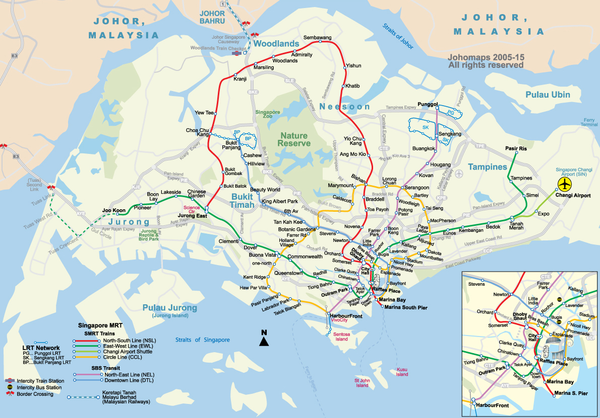

\pagebreak

```{r, include = FALSE}
knitr::opts_chunk$set(echo = TRUE) 

#Setting working directories
try(setwd("/Users/emiliasicari/Desktop/Final_assignment/"), silent = TRUE)
try(setwd("/Users/rafalopezv/Dropbox/R/Final_assignment/"), silent = TRUE)

#Loading packages 
library(Quandl)
library(rio)
library(ggplot2)
library(stargazer)
library(pander)
library(knitr)
library(corrplot)

#Sourcing the external Rscript in which we created the dataframe from which extrapolate the data to create the summary table

source("Preliminary_analyses.R")

```

#Introduction

#Literature review


#General overwiew of the project

##Research question, justification and hypotheses

The aim of our work is to investigate **how the rise in inequality, economic growth, population growth,  usage of public transportation modes and the presence of cars influence the purchase of new cars in Singapore**. 

Singapore claims to be a successful country, which accorindig the its national discourse imply  having high  standards of competition, social welfare and mainly economic  development. The government of Singapore constantly displays [how well ranked the country is]( http://www.egov.gov.sg/accolades-and-awards-international-awards), in order to promote the *'success'* paradigm. Kishore Mahbudani, Dean of Lee Kuan Yew School of Public Policy, recently stated that the island went from having a 500 dollars GDP per capita in 1965 to 76.237 dollars in 2015, almost doubling U.K., its former colonizer. Likewise, he added that *'more than one out of six households have $1 million in cash savings'* [@LecturebyDeanKish:2015vv]. International competitiveness of Singapore is out of doubt. However, how competitive Singaporeans are between each other, how unequal the society is and what is triggered by this traits, are considerations worth analyzing. 

According to a recent survey [@Mahbudani:2015vu], 9 out 15 Singaporeans agreed that its society is based on competitiveness, materialism, self-centredness, *'kiasi-ism'* (fear of diying) and blame-shifting. Additionally,the same rate of Singaporean youngsters are worried that extreme competition would get them out of not affording what they called "basic goods", namely flats and cars. [@Rachel:2014wq].

The consideration of cars as a basic need, in a country that has relentlessly tried to have world class transportation systems, indicates that there are other reasons for owning cars than simply commuting. In fact, the country displays a variety of alternative public means of transportation covering almost all the island, a factor that should limit the scope of owing a car. In fact, a part from buses and taxis (that are public in Singapore), the country also has two extensive rail lines, the MRT (Mass Rapid transit) and the LRT (Light Rail Transit, complementing the MRT). 



In addition, Singapore has tried to deter the purchase of cars by subjecting the purchase of cars to high taxation: in fact  car onwers need to own a certificate of car entitlement that can cost even more than 70.000 dollars [@LandTransportAuthority:2014ue]. Therefore and paradoxically *'Singapore has made the car one of the most important status symbols in Singapore. This explains the attraction of European car brands in Singapore'* [@Mahbudani:2014tv]. Arguably, all cars in Singapore can be considered luxury, since the final price is the result of adding the market price to the 70.000 average Certificate of Entitlement. For example, as in 2014 a Mercedes Benz E-class costed upwards of 277.000 plus an  79.000 Singaorean dollars for the Certificate of Entitlement, whereas in Germany a Mercedes Benz E-class costed 71.062 singaporean dollars upwards; 5 times less[@TheStraitsTimes:2014vf].

When the number of private cars grows, despite the attempt of the state to reduce their usage [@TheEconomist:2012wi] through extensive provision of public transports and high taxation on car purchasing, such overpopulation of might be understood under the lenses of high inequality, fierce competition and the need of displaying status symbols.

##Description of variables 

Under these sonsiderations, we collected data on economic growth, inequality, population, usage of public tranports, and number of cars in Singapore from 1994 to 2015.

Economic growth is measured by Singopore's GDP per capita in singaporean dollars (in thousands) at current prices. 

Inequality is measured by the number of times by which the top 10% earners are richer than those earning the bottom 90% average income. Both top 10% and bottom 90% average income are measured in real singaporean dollars (in thousands). 

Finally, the usage of public transports can be divided into three parts:

- usage of buses;

- usage of MRT;

- usage of LRT.

In all of the cases data is expressed by the daily average of  commuters (in thousands) using public trasport yearly.

The following table summarizes the variables taken into consideration for the analysis ^[Time frame refers to the time span available in the sources from which gathered the data. Instead, as specified by the research question, our analysis only takes into account the years from 1995 to 2014].

```{r, echo = FALSE, message=FALSE, warning = FALSE, results='asis'}

# Creating the summary table stated before
Variable <- c("GDP per capita", "Population", "Top 10% average income", "Bottom 90% average income", "Inequality","Cars", "Public transport utilization")

Description <- c("Current price GDP divided by the population, in singaporean dollars (thousands)", "Singapore permanent and termporary residents", "Yearly average income earned by the top 10% of the poluation in real singaporean dollars", "Yearly, average income earned by the bottom 90% of the poluation in real singaporean dollars", "Difference beteen top 10% and bottom 90% average income (number of times)", "Yearly number of private cars", "Average daily commuters using MRT, LRT, buses (in thousands)")  

Time.frame <- c("1980-2021", "1960-2015", "1947-2009", "1947-2009", "1947-2009", "1960-2015", "1995-2014")

data.table <- data.frame(Variable, Description, Time.frame)

pander::pander(data.table, split.cells = 30, split.table = Inf, keep.line.breaks = TRUE,
               justify = "left", caption = 'Summary of variables')
```

The relation between the variables is the following: 

- *Dependant variable:* Purchase of new cars

- *Independant variables:* 
    + Population of cars
    + Income inequality
    + Use of public transportation modes
    + Gdp percapita

## Hypotheses 

The hypthesis to be tested, under certain assumptions, are:

- *H1:* The higher the economic growth, the higher the purchase of cars
    + *Assumption:* Economic growth increases disposable income, reduces budgetary constraints and increases propensity to spend, specially for the upper class.   
    
- *H2:* The higher the inequality, the higher the purchase of  cars
    + *Assumption:* The emerging and consolidated social classes need to set reference points displaying their status, by buying cars (symbols) 

- *H3:* The less usage of public transport, the higher the purchase of cars
    + *Assumption:* Despite the density of public transportantion modes, commuters choose cars by incentives not explained by the ratinal choice standard model (ego, salience)  
    
- *H4:* The more population, the higher the purchase of cars
    + *Assumption:* The increase of population with purchasing power are highly influenced by the social norms driving to buy more cars. These, are not neccessarily rational, but behavioral deviations from it.  
    
- *H5:* The  larger the car population, the higher the purchase of cars
    + *Assumption:* The average social reference poimt is having a car, thus, that is the threshold to reach 

##Methodology

##Data sources and gathering

The data for our empirical analysis were retrieved from the following sources:

- IMF Cross Country Macroeconomic Statistics open data available on [Quandl](https://www.quandl.com/data/ODA/SGP_NGDPPC). From this source we downloaded data showing the trend in Singopore's GDP per capita meassured in singaporean dollars from 1981 to 2021 (forecasted from 2015 onwards). The data was provided in csv format and imported on R using the URL of the website.

- World Top Incomes Database available on [Knoema](http://knoema.com/), provides access to data on the distribution of top incomes in more than twenty five countries across the globe. From this source we downloaded data on the top 10% average income and bottom 90% average income in Singapore from 1947 until 2009, meassured in singaporean dollars. Since it was not possible to directly import the database to R, we requested and received the data via e-mail in csv format. This data set is available in the repository.^[We did not gather data from the database [Clio Infra](https://www.quandl.com/data/CLIO/SGP_II-Income-Inequality-Singapore) as initially stated in our [ResearchProposal](https://github.com/EmiliaSicari/ResearchProposal), since  it did not provide sufficient data for the time span we are considering.]

- [Singapore's open data portal](https://data.gov.sg) offered two data bases: 
    + The [Annual Motor Vehicle Population](https://data.gov.sg/dataset/annual-motor-vehicle-population-by-type-of-vehicles),  provides the number of public and private vehicles from 1960 to 2015, including: mortorbikes, rental cars, buses, taxis and other type of vehicles. While mortorbikes, rental cars and cars are private means of transportation, buses and taxis are to be considered public since in Singapore even the taxis are provided by the state. Data were imported on R using the URL of the website.
    
    + [Public transport utilization](https://data.gov.sg/dataset/public-transport-utilisation-average-public-transport-ridership). This data is expressed as the daily average of thounsand commuters using public trasport by year. It covers the span from 1995 to 2014 and includes the following modes of transportation: MRT (underground), LRT (a localised rail systems acting as feeder services to the Mass Rapid Transit network), taxis (publicly run) and buses. Data were imported on R using the URL of the website.
    
    + [Population Trend](https://data.gov.sg/dataset/resident-population-by-ethnicity-gender-and-age-group/resource/f9dbfc75-a2dc-42af-9f50-425e4107ae84). The data shows the trend in the number of Singapore  residents by ethinc group and gender (male and females) between 1960 and 2015 in absolute number. Ethnic gruop include Malays, Chinese, Indiand (including Sri Lankans); other less represented ethincities are grouped together under the label "Other Ethnic Groups (Total)". Data were imported on R using the URL of the website.

## Cleaning, processing and merging data sets

After importing data we used the "date" variable (year) as a unique identifier for all four datasets, in order to merge them afterwards. The following operations were needed before proceeding to the merge.

Since time frames of the data were different, we selected a common span of time: 1995-2014. In the case of bottom 90% and top 10% average income, we had to make a linear regression to forecast missing values (from 2009 until 2014): in the linear regressions both top 10% and bottomo 90%  average income were used as dependent variables, while the year was used as independent variable; then, the coefficient was multiplied by the lacking years. The results, available in a new dataframe, were later on bounded with the orginal one, in order to have the entire time series.  As for LRT, values from 1995 until 1998 were missing since the service started to be provided from 1999 [@SingaporeInfopedia:2005tl]; therefore, we completed the dataframe giving the value "0" for the first 4 years of the time span taken into consideration.

Cleaning the data was limited to changing column names, eliminating the unnecesary ones and organizing the various data frames so to merge them more easily afterwards, using the year as common denominator. Only in the case of the dataframe cointaining the number of private cars in Singapore from 1995 until 2014 we had to change the format of the data from characters to integers, due to an incorrect import.

In order to have an indicator showing the trend in inequality in Singapore between 1995 and 2014, we created a new variable - named "inequality" - by divididing the top 10% avereage income by the bottom 90% average income for each year: the coefficient of the division shows how many times Singaporeans earning the top 10% average income are reacher than the bottom 90% earners of the population.  

As for the number of cars, we simply divided them into the categories provided in the data original set: cars, buses, etc. Originally, they were in one column so we separate them in several ones to have the year as a unique identifier. 

Finally, we merged all the single dataframes into the new one, containing all the variables that we used to perfom descriptive and inferential statistical analyses.

##Packages used
This document and particularly data processing was made using: R [-@CiteR], Quandl [-@R-Quandl], Corrplot [-@R-corrplot], Ggplot[-@R-ggplot2], Pander [-@R-pander], Stargazer [-@R-stargazer], Knitr [@-R-knitr], Rio [-@R-rio], Gtable [-@R-gtable], Grid [-@R-grid], Scales [-@R-scales].

#Statistical analysis

##Descriptive statistics and central tendency

The table below shows the basic decriptive statistics for our variables.

Throughout the period the average GDP per capita is 50.277 singaporean dollars, but it varied a lot, ranging from a minimum of 35.345,5 to 70.966,9 singaporean dollars per person. Similarly, the population has increased by only 28% between 1995 and 2015, with an average of 3,471,255.0 people living in the Island.A grater variation can be observed in the top 10% average income, whose value has been increasing reaching the peak of 325,450 singaporean dollars. Compared to the top 10%, the bottom 90% average income witnessed a more reduced change and its average of 29.022 singaporean dollars shows a great distance from the top 10% earners. In fact, if we look at inequality we see that on average top 10% average income is 6 times greater than the bottom 90% average income. Moreover, the difference between the richest and the poorest has been high for the entire period, with the top 10% earners gaining from 4 to 8 times more than the bottom 90% earners. 

As for the number of vehicles, troughout the period there were, on average, 466.148 cars in Singapore, and their number varied consistently, with a minimum of 342.245 (in 1995) and a maximum of 607.292 (in 2013). Instead, the variation in the number of rental cars, taxis, buses and motorbikes was more restrained, as shown by the standard deviation.  

Finally, if we look at the usage of public transports, we see that the highest variation in the number of passengers was witnessed by the MRT, with a number of daily commuters ranging from 740 to 2762 thousands. However, buses show the highest number of average daily passengers, whose amount was more stable than MRT passengers in the time-span considered. Finally, the LRT displays the lowest amount of daily passengers and a relatively low variation, probably due to the fact that the service was only provided from 1999 onwards [@SingaporeInfopedia:2005tl]. 


```{r, echo = FALSE, message=FALSE, warning = FALSE, results = "asis"}


#Creating a new data frame without date for summary purposes
data.final.s <- data.final

data.final.s <- data.final.s[,c("gdp.per.capita","inequality", "cars", "bus.u","mrt.u", "top", "bottom", "population", "lrt.u")]

# Changing the order and the names of columns
data.final.s <- data.final.s[,c(1,8,6,7,2,3,4,5,9)]
names(data.final.s) <- c("GDP per capita", "Population", "Top 10% average income", "Bottom 90% average income", "Inequality", "Cars", "Bus usage", "MRT usage", "LRT usage")

# Creating the table
stargazer(data.final.s, type = "latex",
        title = "General data summary",
        digits = 1, header = FALSE)

```

###Trends in gdp per capita and inequality

The following graph shows the trend of the explanatory variables in Singapore between 1995 and 2014. As we can see, although slowly, the gdp per capita has risen thourghout the whole period, despite a slight decline between 2002 and 2005 and a more serious reduction in the years of the financial crisis, between 2008 and 2010. The top 10% average income shows the same trend: a steady increase throughout the whole period (in 2014 its value was more than 100% higher than the initial one), with a slight decline between 2002 and 2005, and a more serious reduction in the years of the financial crisis. However, the value of the bottom 90% average income has barely changed, enlarging the difference between the top and bottom populations. 

```{r, echo=FALSE, fig.align='center', fig.width = 6, fig.height = 4, fig.cap= "Gdp per capita, top 10% and bottom 90% average income in Singapore measured in national currency at current prices (1995-2014)"}

# Creating first figure: trend in gdp, bottom 90% and top 10% average income
fig.1 <- ggplot2::ggplot(data.final, aes(x= date)) +
  geom_line(aes(y=data.final$top, color= "top")) +
  geom_line(aes(y=data.final$bottom, color = "bottom")) + 
  geom_line (aes(y=data.final$gdp.per.capita, color = "gdp.per.capita")) +
  theme_light()

#changing the name of the variables in the axis
fig.1<-fig.1 + labs(x = "years", y = NULL)

#changing the position of the legend 
fig.1 <- fig.1 + theme(legend.position="bottom")

#changing the name of title and labels of legend
fig.1 <- fig.1 + scale_colour_discrete(name= NULL,
                         breaks=c("bottom", "gdp.per.capita", "top"),
                         labels=c("Bottom 90% average income", "Gdp per capita",
                                  "Top 10% average income"))

#changing the colour of the background of the plot
fig.1 <- fig.1 + theme(panel.border = element_blank(),
                       panel.grid.major = element_blank(),
                       panel.grid.minor = element_blank(),
                       axis.line.x = element_line(size = 0.25, linetype = "solid",
                                   colour = "black"), 
                       axis.line.y = element_line(size = 0.25, linetype = "solid", 
                                                  colour = "black"))
fig.1

```

The growing difference between the top and bottom earners is clarified by the following graph, showing trend in inequality in Singapore, measured in number of times by which the top 10% earners are richer than those earning the bottom 90% average income. The graph confirms what already highlighted above: the difference between the rich and the poor has been increasing all the time, and the trend only reversed between 2002 and 2005 and between 2008 and 2010. The average ratio between both groups is 6.1 and has reaached a maximun value of 7.8.

```{r, echo=FALSE, fig.align='center', fig.width = 6, fig.height = 4, fig.cap= "Inequality in Singapore measured by the distance between the top 10% and bottom 90% average income in number of times (1995-2014)"}

#creating the second figure: trend in inequality in number of times. 
fig.2 <- ggplot2::ggplot(data.final, aes(x=data.final$date, y=data.final$inequality)) + geom_line(aes(group=1), colour="#3399FF") + theme_classic()

#changing the name of the variables in the y axis
fig.2 <-fig.2 + labs(x = "years", y = "inequality")

#changing the colour of the background of the plot
fig.2 <- fig.2 + theme(panel.border = element_blank(),
          panel.grid.major = element_blank(),
          panel.grid.minor = element_blank(),
          axis.line.x = element_line(size = 0.25, linetype = "solid",
                                   colour = "black"), 
          axis.line.y = element_line(size = 0.25, linetype = "solid",
                                   colour = "black"))
fig.2
```

###Trends in the number of privately owned cars

A shiwn by following graph, the number of private cars present in Singapore between 1995 and 2015 has been growing throughout the period, especially from 2006 onwards and with a slight reduction between 1997 and 1998 and between 2001 and 2002. Similarly, the number of residents has been growing over the period, and the rise was even more continuous and steady than the one characterising private cars. Therefore, together with the trends observed in the previous graphs, this patterns supports the hypotheses  linking high economic growth, high inequality and increase of cars' purchase ^[For more details about the hypotheses see https://github.com/EmiliaSicari/ResearchProposal]. A further assumption to be investigated is that such increase might be linked to the likewise rise in the top 10% average income: as the rich become richer, the purchase of luxury goods, such as cars, increases as well. 

```{r, echo=FALSE, fig.align='center', fig.width = 6, fig.height = 4, fig.cap= "Trend in the number of private cars in Singapore compared to the population increase (1995-2014)"}

#loading packages
library(gtable)
library(grid)
library(scales)
grid.newpage()

# two plots
p1 <- ggplot(data.final, aes(x=data.final$date, y=data.final$cars)) + geom_line(colour = "blue") + theme_light() + theme(panel.border = element_blank(), panel.grid.major = element_blank(), panel.grid.minor = element_blank(), axis.line.x = element_line(size = 0.25, linetype = "solid", colour = "black"), axis.line.y = element_line(size = 0.25, linetype = "solid", colour = "black")) + labs(x= NULL, y="Number of cars") + scale_y_continuous(name= NULL, labels = comma)

p2 <- ggplot(data.final, aes(x=data.final$date, y=data.final$population)) + geom_line(colour = "red") + theme_bw() %+replace% theme(panel.background = element_rect(fill = NA)) + theme(panel.border = element_blank(), panel.grid.major = element_blank(), panel.grid.minor = element_blank(), axis.line.x = element_line(size = 0.25, linetype = "solid", colour = "black"), axis.line.y = element_line(size = 0.25, linetype = "solid", colour = "black")) + labs(x= NULL, y="Population")

# extract gtable
g1 <- ggplot_gtable(ggplot_build(p1))
g2 <- ggplot_gtable(ggplot_build(p2))

# overlap the panel of 2nd plot on that of 1st plot
pp <- c(subset(g1$layout, name == "panel", se = t:r))
g <- gtable_add_grob(g1, g2$grobs[[which(g2$layout$name == "panel")]], pp$t, 
    pp$l, pp$b, pp$l)

# axis tweaks
ia <- which(g2$layout$name == "axis-l")
ga <- g2$grobs[[ia]]
ax <- ga$children[[2]]
ax$widths <- rev(ax$widths)
ax$grobs <- rev(ax$grobs)
ax$grobs[[1]]$x <- ax$grobs[[1]]$x - unit(1, "npc") + unit(0.15, "cm")
g <- gtable_add_cols(g, g2$widths[g2$layout[ia, ]$l], length(g$widths) - 1)
g <- gtable_add_grob(g, ax, pp$t, length(g$widths) - 1, pp$b)

# draw it
grid.draw(g)

#http://www.r-bloggers.com/r-single-plot-with-two-different-y-axes/ (to add legend)

```

At the same time,  the number of passengers in the main public transportation (MRT and buses) has increased consistenlty over time. Despite that, the publicly owned buses have not significantly changed in number. Consequently, this also supports the hypothesis that the usage of public transport is not entirely linked with the purchase of cars: in fact, usage of public transport has either increased (in the case of MRT and buses) or stayed the same (in the case of LRT), while the number of private cars has grown consistently. Even in this case a further assumption to be investigated is that those using public transports are lower earners. 

```{r, echo=FALSE, fig.align='center', fig.width = 6, fig.height = 4, fig.cap = "Average daily passengers using public transport in Singapore \n in thousands (1995-2014)"}

#Creating the fourth figure: trend in vehicles utilization           
fig.4 <- ggplot2::ggplot(data.final, aes(x=data.final$date)) + 
  geom_line(aes(y=data.final$bus.u, color="buses")) + 
  geom_line(aes(y=data.final$mrt.u, color="MRT")) + 
  geom_line(aes(y=data.final$lrt.u, color="LRT")) + theme_light()

#changing the name of the variables in the y axis
fig.4 <-fig.4 + labs(x = "years", y = NULL)

#changing the colour of the background of the plot and making axis appear
fig.4 <- fig.4 + theme(panel.border = element_blank(),
                       panel.grid.major = element_blank(),
                       panel.grid.minor = element_blank(),
                       axis.line.x = element_line(size = 0.25, linetype = "solid",
                                   colour = "black"), 
                       axis.line.y = element_line(size = 0.25, linetype = "solid", 
                                                  colour = "black"))

##changing the position of the legend 
fig.4 <- fig.4 + theme(legend.position="bottom")

#changing the name of title and labels of legend
fig.4 <- fig.4 + scale_colour_discrete(name= NULL,
                         breaks=c("buses", "LRT", "MRT"),
                         labels=c("buses", "MRT", "LRT"))

fig.4
```

##Correlation analysis

The graph below shows the correlation among the varibles considered in our analysis: the darker the colour, the stronger the correlation. Likewise, the magnitude of the correlation is pointed out by the coefficients in eac box. While blue indicates positive correlation, red is associated with negative correlation.

What clearly emerges from the plot, is that the variables are in almost all of the cases highly and positively correlated to each other. Bottom 90% average income and buses utilization are less correlated to the other variables. Moreover, the two variables show a low negative correlation, weakening the assumption that the poorest are those who use more public transportations. Similarly, Inequality is negatively correlated with bottom 90% averag income, suggesting that the rise in inequality depends more on the increased wealth in the hand of those earning the top 10% average income (in fact, the latter is highly positively correlated with inequality) However, high correlation among explanatory variables might create problems due to multicollinearity and may show a bias in the variables in general. 

``````{r, echo=FALSE, fig.align='center', fig.cap="Correlation Matrix", fig.width = 14, fig.height = 14}
# Creating a correlation plot
source("http://www.sthda.com/upload/rquery_cormat.r") 
corrplot(cor(data.final.s), method = "number", type = "lower")
```

##Inferential Statistics

```{r, echo=FALSE, warning=FALSE, error=FALSE, message=FALSE, results="asis", header=FALSE}
stargazer::stargazer(M4, dep.var.labels=labelsi4, covariate.labels = labelsd4,
                     title = 'Regression Results',
                     single.row = TRUE, digits = 2, type = 'latex', out = 'Regression_Results.pdf', header = FALSE)
```

#Conclusions

\pagebreak 

#References
