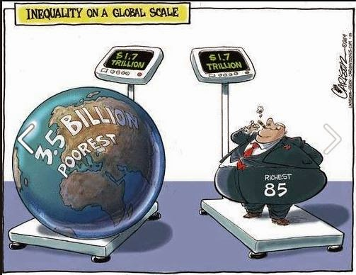
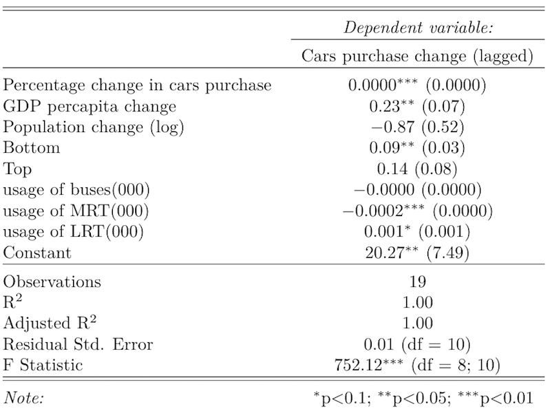

```{r setup, include=FALSE}
knitr::opts_chunk$set(echo = FALSE)

#Setting the working directories
try(setwd("/Users/emiliasicari/Desktop/Final_assignment/Presentation/"))
try(setwd("/Users/rafalopezv/Dropbox/R/Final_assignment/Presentation/"))

#Sourcing external files
try(source("/Users/emiliasicari/Desktop/Final_assignment/Preliminary_analyses.R"))
try(source("/Users/rafalopezv/Dropbox/R/Final_assignment/Preliminary_analyses.R"))
try(source("/Users/emiliasicari/Desktop/Final_assignment/Presentation/Figures.R"))
try(source("/Users/rafalopezv/Dropbox/R/Final_assignment/Presentation/Figures.R"))

#Loading packages
library(ggplot2)
library(stargazer)

```

## <small>Overview</small>

1. Theoretical background

2. Research question, justification and hypotheses 

3. Description of variables

4. Results

5. Conclusions

## <small>'The challenge of our time'</small>



## <small>Some 'crude' facts about inequality</small>

- The richest **1% of the** population is **wealthier than the rest of the world combined**.

- In 2010, **388 individuals** had the same wealth as 3.6 billion people.

- In 2015, this share of population further narrowed to **62 people**.

- In the last 15 years, the **average annual income of the poorest 10%** of people in the world has **risen by less than a single dollar cent per year**.

## <small> Theoretical background </small>

- Two-sided relation between economic growth and inequality;

- Inequality causes different consumption behaviours:

    + Rational choice theory vs behavioural economics
    
- Consumers' choice is shaped by reference points and "irrational" causes 

- Reference points are fed by inequality

## <small>Research question</small>

How the rise in inequality, economic growth, population growth, the usage of public transportation modes, and the presence of cars influence the purchase of new cars in Singapore?


## <small>Hyphoteses</small>

- **H1:** The higher the economic growth, the higher the purchase of cars
    
- **H2:** The higher the inequality, the higher the purchase of cars

- **H3:** The less usage of public transport, the higher the purchase of cars

- **H4:** The more population, the higher the purchase of cars

- **H5:** The  larger the car population, the higher the purchase of cars

## <small>Singapore</small>

- A successful economy...

- ... with a world class transportation system...

- ... and policies deterring the purchase of private cars


## <small>Independent variables: population trend</small>

```{r, echo=FALSE, fig.align = 'center'}
plot(POPULATION)
```

## <small>Independent variables: GDP per capita, top 10% and bottom 90% average income</small>

```{r, echo=FALSE, fig.align = 'center'}
plot(IV)
```

## <small>Independent variables: inequality gap</small>

```{r, echo=FALSE, fig.align = 'center'}
plot(INEQUALITY)
```

## <small>Independent variables: number of daily commuters using public transports</small>

```{r, echo=FALSE, fig.align = 'center'}
plot(PT)
```

## <small>Dependent variable: number of private cars</small>

```{r, echo=FALSE, fig.align = 'center'}
plot(CARS)
```

## <small>Regression analysis</small>

- In our inferential analyses, we perfomed a multiple regression. 

- We regressed the percentage change of cars (C) on the lagged existing number of cars (EC), the percentage change in GDP per capita (GDPpc), percentage change in population (POP), lagged bottom 90% average income (BOT), lagged top 10% average income, and average daily commuters on buses (BUS), MRT and LRT.

<small>**$$C_{T} = {\beta}_1 + {\beta}_2 EC_{t-1} + {\beta}_3 GDPpc_{ch} + {\beta}_4 POP_{ch} + {\beta}_5 BOT_{t-1} + {\beta}_6 TOP{t-1} +$$**</small>
<small>**$$+ {\beta}_7 BUS_{u} + {\beta}_8 MRT_{u} + {\beta}_9 LRT_{u} $$**</small>

## <small>Regression results</small>

```{r, echo=FALSE, include = FALSE, warning=FALSE, error=FALSE, message=FALSE, results="asis", header=FALSE}
stargazer::stargazer(M4, dep.var.labels=labelsi4, covariate.labels = labelsd4,
                     single.row = TRUE, no.space = TRUE, font.size = "tiny",
                     digits = 2, type = 'html', header = FALSE)
```



## <small>Main findings(1)</small>

- Rather than inequality, it is the consumption behavior of the bottom 90% of the population that influences the purchase of cars:

    + if the bottom 90% average income increased to approximately $60.000, the number of cars would increase by 9%;

- The presence of cars has only a slight influence on new buyers.

## <small>Main findings(2)</small>

- A rise in the GDP per capita by 10%, causes an increase in the number of cars by 2.3%;

- Population trend has does not affect the number of cars;

- MRT and LRT have a in impact on the population of cars, but only MRT decreseas their number.

## <small>Conclusions</small>

- The model matches almost all the hypotheses, however, its explanatory power is limited:
    + R squared is too high probably because of the low number of observation and the high correlation between the variables;
    + The model demonstrate that the lower classes have more impact on the car consumption
    + Consumption behaviour might be a way to improve the rank in the social hierarchy
    + more population quartiles in terms of income would be useful to know which segment of the population is affecting more purchase of cars and its relation with the social status.